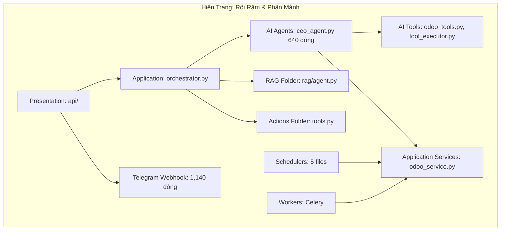
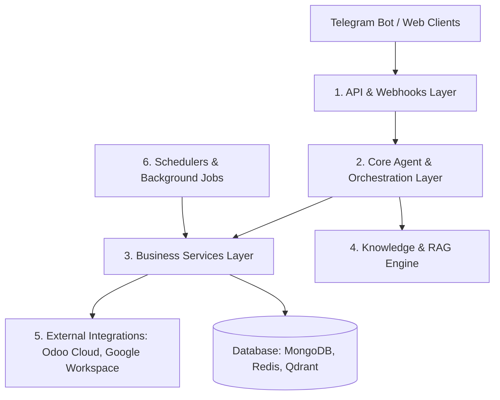

# BÁO CÁO PHÂN TÍCH, BÀN GIAO VÀ ĐỀ XUẤT TÁI CẤU TRÚC HỆ THỐNG
## DỰ ÁN: HM AI-AGENT (TRỢ LÝ ĐIỀU HÀNH THÔNG MINH ĐA TÁC NHÂN)

> **Người thực hiện:** Đội ngũ Kỹ thuật / Kế thừa Dự án  
> **Kính gửi:** Ban Giám đốc / Trưởng bộ phận Công nghệ  
> **Ngày báo cáo:** 05/10/2026  
> **Phiên bản:** 1.0  

---

## 1. TỔNG QUAN DỰ ÁN (EXECUTIVE SUMMARY)

### 1.1. Dự án này là gì?
**HM AI-Agent** là hệ thống **Trợ lý Điều hành Số Đa Tác Nhân (Multi-Agent Executive Assistant)** ứng dụng Trí tuệ Nhân tạo (LLM) để tự động hóa công việc hỗ trợ Ban Lãnh đạo (CEO) và các Trưởng bộ phận trong doanh nghiệp.

Thay vì người dùng phải tự đăng nhập vào nhiều phần mềm riêng lẻ để tra cứu số liệu, hệ thống đóng vai trò như một **Đầu mối Trí tuệ Duy nhất (Single Point of Intelligence)**:
* Tiếp nhận câu hỏi bằng ngôn ngữ tự nhiên tiếng Việt qua **Telegram Bot** hoặc **Giao diện Web**.
* Tự động điều phối tác vụ tới các Agent chuyên môn (CEO Agent, Sales Agent, HR Agent...).
* Truy vấn trực tiếp dữ liệu nghiệp vụ thời gian thực và sinh câu trả lời/báo cáo phân tích chuyên nghiệp.

### 1.2. Khả năng ứng dụng thực tế với Odoo Cloud của Công ty
Một điểm cốt lõi quan trọng: **Dự án KHÔNG đòi hỏi phải có mã nguồn (source code) của Odoo và KHÔNG cần cài đặt thêm module vào server Odoo.**
* Hệ thống hoạt động theo mô hình **Middleware độc lập**, kết nối vào **Odoo Cloud (Odoo Online / Odoo.sh)** thông qua chuẩn **XML-RPC External API** có sẵn mặc định của Odoo.
* **Giá trị khai thác ngay cho công ty:**
  1. **Tra cứu kinh doanh tức thì:** Hỏi nhanh qua Telegram về Doanh thu dự báo, Tiến độ Sales Pipeline, Danh sách khách hàng lớn, Các deal đang đàm phán, Các hoạt động/cuộc gọi chăm sóc khách hàng đang bị trễ hạn (Overdue).
  2. **Tự động gửi Báo cáo Điều hành:** Hệ thống tự động tổng hợp số liệu Odoo mỗi sáng / cuối tuần, tính tỷ lệ chuyển đổi, so sánh với KPI và gửi file báo cáo tổng quan trực tiếp vào Telegram của Lãnh đạo.
  3. **Hợp nhất Văn phòng số:** Kết hợp dữ liệu bán hàng Odoo với **Lịch họp Google Calendar** và **Email khẩn từ Gmail** trên một màn hình chat duy nhất.
  4. **Tra cứu Quy định / Tài liệu nội bộ (RAG):** Đọc tự động các file quy chế, chính sách bán hàng từ Google Drive để giải đáp cho nhân viên.

---

## 2. ĐÁNH GIÁ HIỆN TRẠNG & NGUYÊN NHÂN GÂY RỐI RẮM

Qua quá trình rà soát toàn diện mã nguồn hiện tại, hệ thống sở hữu nền tảng nghiệp vụ phong phú nhưng đang gặp các vấn đề lớn về mặt cấu trúc và tiêu chuẩn kỹ thuật:

### 2.1. Cấu trúc bị "lai tạp" (Anti-pattern)
* Dự án đang cố gắng áp dụng **Clean Architecture** (`domain`, `application`, `infrastructure`, `presentation`) nhưng đồng thời lại tạo thêm các thư mục theo **Feature** (`rag`, `ai`, `actions`, `reporting`, `schedulers`, `workers`).
* **Hậu quả:** Gây nhập nhằng trách nhiệm. Ví dụ:
  - Logic gọi LLM vừa nằm ở `backend/application/orchestrator.py`, vừa nằm ở `backend/rag/agent.py`.
  - Bộ công cụ (Tools) vừa nằm ở `backend/actions/tools.py` (Pandas CSV), vừa nằm ở `backend/ai/tools/ceo/` (Odoo, Gmail).
  - Tác vụ ngầm vừa có trong `backend/schedulers/` (APScheduler/Background Tasks), vừa có trong `backend/workers/` (Celery).

### 2.2. "God Files" (Tệp tin phình to, ôm đồm quá nhiều việc)
* File `backend/presentation/api/telegram_webhook.py` dài hơn **1.140 dòng code**: vừa nhận webhook, vừa parse text, vừa gọi dịch vụ nghiệp vụ, vừa render HTML/Markdown và gửi file.
* File `backend/ai/agents/ceo_agent.py` dài hơn **640 dòng code**: chứa cả lớp thu thập số liệu (MetricsCollector), logic phân tích Odoo và định dạng phản hồi.

### 2.3. Rủi ro An toàn Thông tin & Vận hành
1. **Rò rỉ thông tin đăng nhập:** File `.env.bak` ở thư mục gốc chứa thông tin kết nối thật của Database MongoDB Atlas, API Key Groq, Gemini và Odoo API Key. *(Cần thu hồi/đổi mới ngay lập tức)*.
2. **Xử lý bất đồng bộ thiếu an toàn (Async Event Loop):** Trong `orchestrator.py` có đoạn tự tạo `asyncio.new_event_loop()` cưỡng ép. Điều này dễ gây xung đột luồng và treo hệ thống (deadlock) khi có nhiều người cùng truy cập vào FastAPI.
3. **Tồn đọng tệp tin rác:** Thư mục gốc chứa các file không cần thiết (`package-lock.json`, `yarn.lock` trong khi dự án thuần Python; các file tạm `celerybeat-schedule*` phát sinh trong runtime).

---

## 3. ĐỀ XUẤT KIẾN TRÚC MỚI CHUẨN HÓA (TARGET ARCHITECTURE)

Để dự án dễ bảo trì, dễ mở rộng tính năng mới và chuyển giao cho các lập trình viên khác, kiến trúc được đề xuất chuẩn hóa theo mô hình **Modular Service-Oriented (Theo tầng dịch vụ rõ ràng)**:

### 3.1. Bảng đối chiếu Cấu trúc Cũ và Mới

| Thư mục Cũ (Rối rắm) | Thư mục Mới (Quy chuẩn) | Trách nhiệm duy nhất (Single Responsibility) |
| :--- | :--- | :--- |
| `backend/presentation/api/` | `backend/api/` | Chỉ tiếp nhận HTTP Request / Webhook, kiểm tra dữ liệu đầu vào (Validation) và trả về response. |
| `backend/ai/agents/` + `application/orchestrator.py` | `backend/agents/` | Chứa các AI Agent (CEO, Sales, HR) và Orchestrator điều phối câu hỏi. |
| `backend/actions/` + `backend/ai/tools/` | `backend/tools/` | Tập trung toàn bộ Tool của Agent (Odoo Tools, Gmail Tools, Pandas Query Tools). |
| `backend/application/services/` | `backend/services/` | Nghiệp vụ trung tâm: `odoo_service`, `gmail_service`, `calendar_service`, `kpi_service`. |
| `backend/rag/` + `application/rag_*` | `backend/rag/` | Gom toàn bộ logic Document Loader, Embeddings, Vectorstore (Qdrant). |
| `backend/schedulers/` + `backend/workers/` | `backend/schedulers/` & `backend/tasks/` | Quản lý lập lịch gửi báo cáo, nhắc lịch họp, đồng bộ Drive. |
| `backend/reporting/` | `backend/reporting/` | Chuyên trách sinh template báo cáo PDF/Excel/Markdown. |
| `backend/config/` + `backend/app/utils/` | `backend/core/` | Cấu hình tập trung (`settings.py`), logging, bảo mật (Security/JWT). |

---

## 4. KẾ HOẠCH HÀNH ĐỘNG & LỘ TRÌNH TRIỂN KHAI (ACTION PLAN)

### Giai đoạn 1: Dọn dẹp & Bảo vệ Hệ thống (Ngay lập tức - 1 đến 2 ngày)
* [x] Đánh giá toàn bộ mã nguồn và thống kê các kết nối dịch vụ.
* [ ] Thu hồi và cấp phát lại các API Key (Odoo API Key, Gemini API Key, MongoDB Atlas connection).
* [ ] Đưa các file cấu hình nhạy cảm (`.env*`, `service_account.json`, `celerybeat*`) vào `.gitignore`.
* [ ] Xóa bỏ các tệp tin dư thừa ở thư mục gốc (`package-lock.json`, `yarn.lock`, file test rời rạc).

### Giai đoạn 2: Tái cấu trúc Thư mục & Codebase (3 đến 5 ngày)
* [ ] Gom nhóm các thư mục chồng chéo (`actions` vào `tools`, chuẩn hóa `services` và `agents`).
* [ ] Tách nhỏ file `telegram_webhook.py` (tách riêng tầng routing và tầng xử lý tin nhắn).
* [ ] Chuẩn hóa cơ chế gọi LLM và sửa lỗi quản lý Async Event Loop trong `orchestrator.py`.
* [ ] Bổ sung cơ chế quản lý biến môi trường tập trung qua `pydantic-settings`.

### Giai đoạn 3: Tích hợp Thực tế với Odoo Cloud & Chạy thử nghiệm PoC (3 đến 5 ngày)
* [ ] Cấu hình thông số kết nối Odoo Cloud thực tế của công ty vào hệ thống.
* [ ] Kiểm tra tính tương thích của các trường CRM chuẩn (`crm.lead`, `res.partner`) với dữ liệu thực tế.
* [ ] Thiết lập Bot Telegram nội bộ để Ban Lãnh đạo dùng thử:
  - Thử nghiệm 1: Hỏi đáp tình hình Doanh thu và Pipeline tuần.
  - Thử nghiệm 2: Nhận Báo cáo Điều hành tự động mỗi 8:00 sáng.
  - Thử nghiệm 3: Xem lịch họp trong ngày.

---

## 5. KẾT LUẬN & KIẾN NGHỊ

Hệ thống **HM AI-Agent** là một giải pháp có **giá trị ứng dụng thực tế rất cao**, đánh trúng nhu cầu quản trị và giám sát kinh doanh tự động của doanh nghiệp mà **không tốn thêm chi phí chỉnh sửa Odoo**.

Mặc dù cấu trúc mã nguồn hiện tại đang bị phân mảnh do quá trình phát triển nhanh từ đội ngũ trước, việc tái cấu trúc theo lộ trình trên là hoàn toàn khả thi và có thể hoàn thành trong thời gian ngắn để đưa vào vận hành thực tế.

**Kiến nghị:** Ban Giám đốc phê duyệt triển khai thử nghiệm giai đoạn 1 (Dọn dẹp bảo mật) và giai đoạn 3 (Kết nối thử nghiệm Odoo Cloud công ty với một nhóm người dùng giới hạn).
