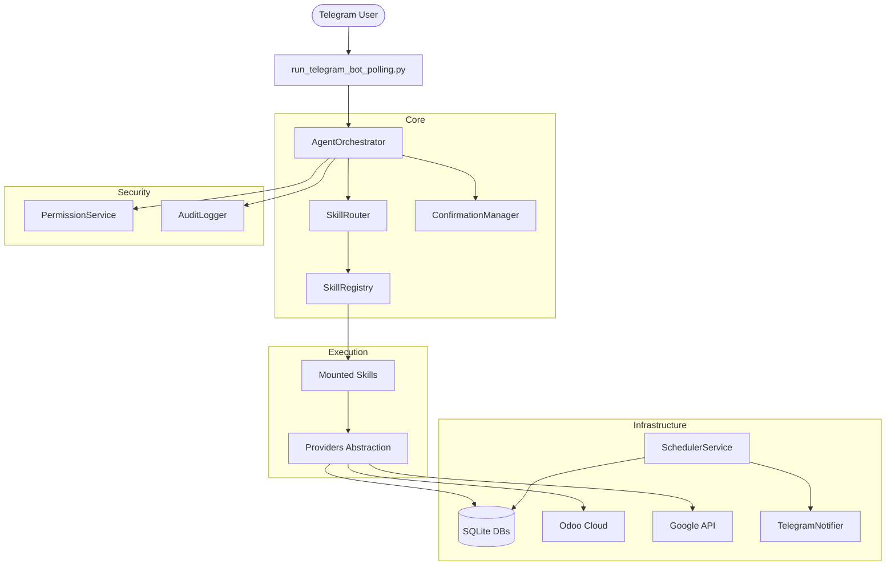

# Hopita AI Office Assistant Architecture

## Core Components
- **AgentOrchestrator**: Manages conversation history, invokes LLM, intercepts function calls, and handles Confirmation & Permissions.
- **SkillRouter**: Routes intents to a subset of skills to avoid context overflow.
- **Providers**: Isolates Skills from raw API requests. Example: `LocalTaskProvider`, `OdooAsyncClient`.
- **ConfirmationManager**: Gating destructive/external actions. Prevents replay attacks.
- **Scheduler**: High-performance background polling for reminders.
